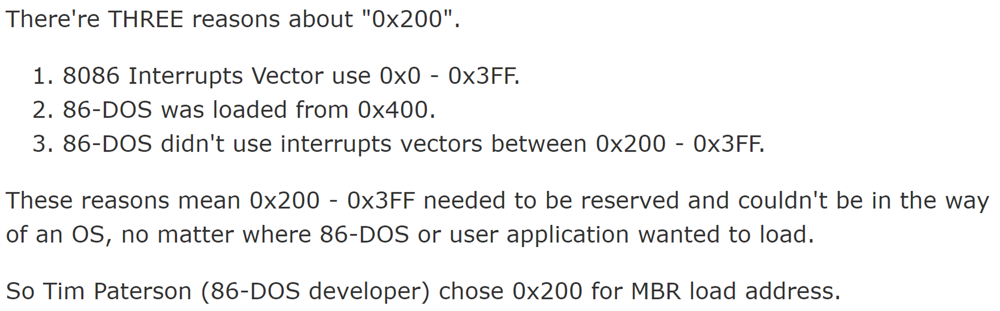

# Why BIOS loads MBR into 0x7C00 in x86

- [Why BIOS loads MBR into 0x7C00 in x86](#why-bios-loads-mbr-into-0x7c00-in-x86)
  - [The mysteries arround "0x7C00" in x86 architecture bios bootloader.](#the-mysteries-arround-0x7c00-in-x86-architecture-bios-bootloader)
  - ["0x7C00" First appeared in IBM PC 5150 ROM BIOS INT 19h handler.](#0x7c00-first-appeared-in-ibm-pc-5150-rom-bios-int-19h-handler)
  - [The origin of 0x7C00 \& 0x200.](#the-origin-of-0x7c00--0x200)
  - [Why that CPU Monitor's bootloader loaded MBR into "0x200"?](#why-that-cpu-monitors-bootloader-loaded-mbr-into-0x200)
  - [Who decided "0x7C00"?](#who-decided-0x7c00)
  - [What "0x7C00 = 32KiB - 1024B" means?](#what-0x7c00--32kib---1024b-means)

## The mysteries arround "0x7C00" in x86 architecture bios bootloader.

  

## "0x7C00" First appeared in IBM PC 5150 ROM BIOS INT 19h handler.

  

## The origin of 0x7C00 & 0x200.

  

## Why that CPU Monitor's bootloader loaded MBR into "0x200"?

  

## Who decided "0x7C00"?

  

## What "0x7C00 = 32KiB - 1024B" means?

  
