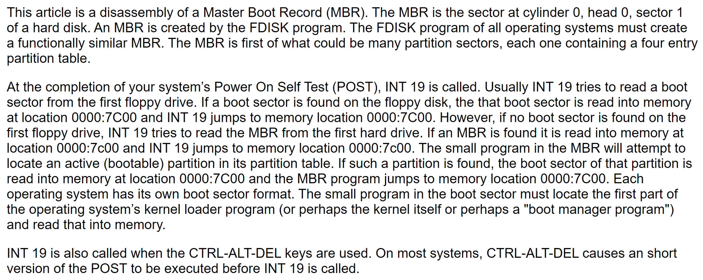

# How BIOS loads MBR into 0x7C00 in x86

- [How BIOS loads MBR into 0x7C00 in x86](#how-bios-loads-mbr-into-0x7c00-in-x86)
  - [Disassembly of a Master Boot Record(MBR)](#disassembly-of-a-master-boot-recordmbr)
  - [Reference code 1 of INT 19H and jmp 0x0000:0x7c00](#reference-code-1-of-int-19h-and-jmp-0x00000x7c00)
  - [Reference code 2 of INT 19H and jmp 0x0000:0x7c00](#reference-code-2-of-int-19h-and-jmp-0x00000x7c00)

## Disassembly of a Master Boot Record(MBR)

 

## Reference code 1 of INT 19H and jmp 0x0000:0x7c00

```
; --------------------- INT 19h - OS Bootstrap loader ------------------
int19 proc near
        mov     ax, 201h
        mov     cx, 1
        mov     dx, 80h
        push    0
        pop     es
        mov     bx, 7c00h
        int     13h
        jc      int19err
        db      0eah
        dw      7c00h, 0     ; jmp far 0000h:7c00h
int19err:
        int     18h
int19 endp
```

## Reference code 2 of INT 19H and jmp 0x0000:0x7c00

```
;=========================================================================
; ipl - Initial Program Load - try to read and execute boot sector
;-------------------------------------------------------------------------
ipl:
    sti
    mov    word [78h],int_1E
    mov    word [7Ah],cs

.retry:
    mov    cx,4            ; try booting from floppy 4 times

.fd_loop:
    push    cx
    mov    ah,00h            ; reset disk system
    mov    dl,00h            ; drive 0
    int    13h
    jb    .fd_failed
    mov    ah,08h            ; get drive parameters
    mov    dl,00h            ; drive 0
    int    13h
    jc    .fd_failed
    cmp    dl,00h
    jz    .fd_failed        ; jump if zero drives
    mov    ax,0201h        ; read one sector
    xor    dx,dx            ; head 0, drive 0
    mov    es,dx            ; to 0000:7C00
    mov    bx,7C00h
    mov    cx,0001h        ; track 0, sector 1
    int    13h
    jc    .fd_failed
    es    cmp    word [7DFEh],0AA55h
    jnz    .fd_failed
    jmp    0000h:7C00h

.fd_failed:
    pop    cx
    loop    .fd_loop

    mov    si,msg_boot_failed
    call    print
    mov    al,ah
    call    print_hex_byte
    mov    si,msg_boot_retry
    call    print
    mov    ah,00h
    int    16h
    or    al,20h            ; convert letters to the lower case
    cmp    al,'f'
    jne    .retry
    ret
```
