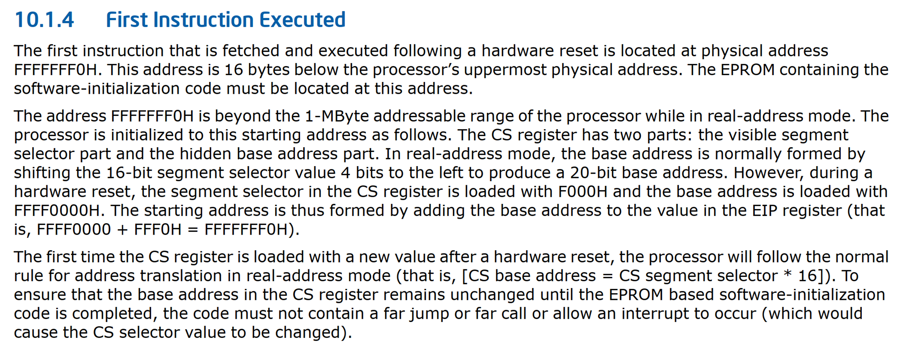
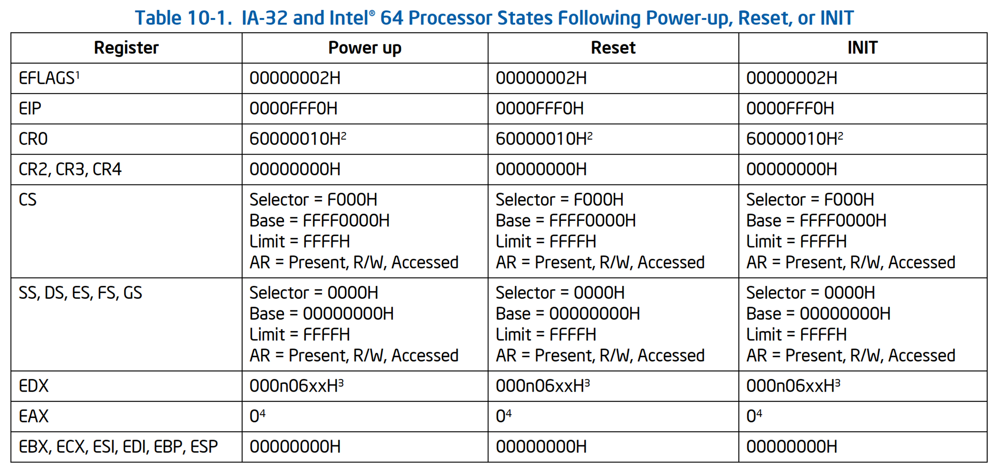
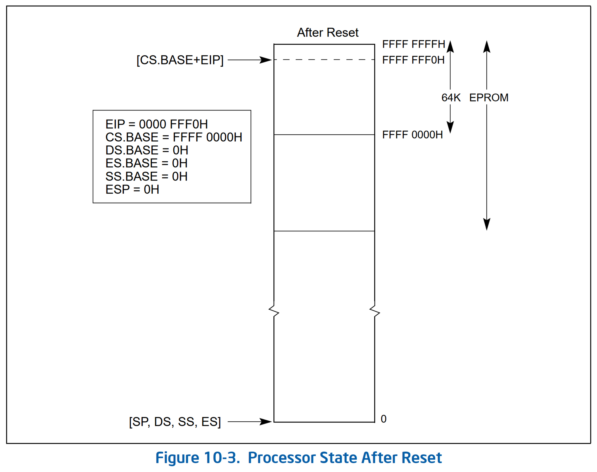
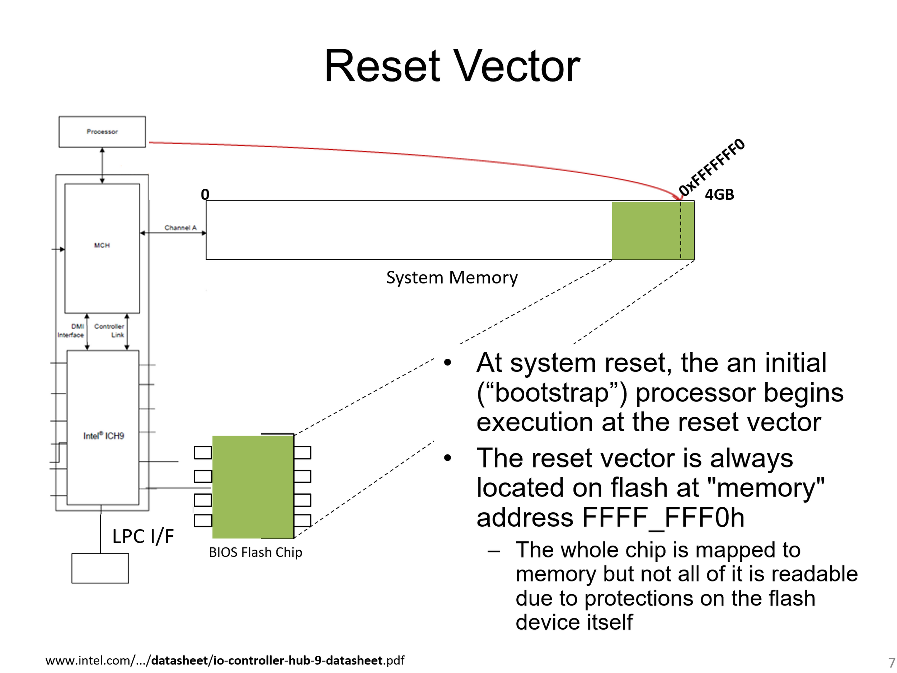
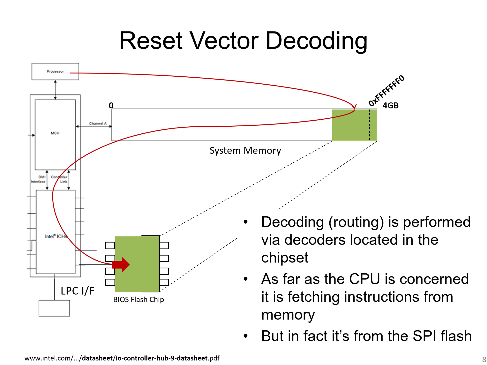
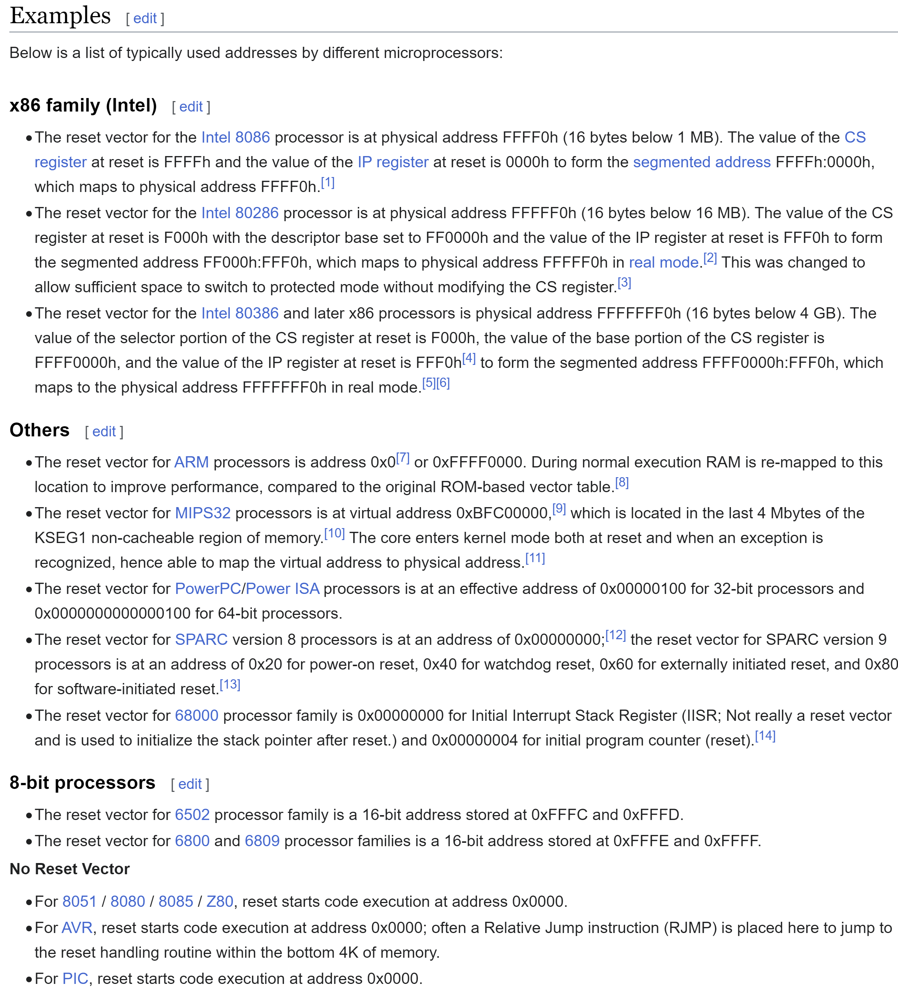
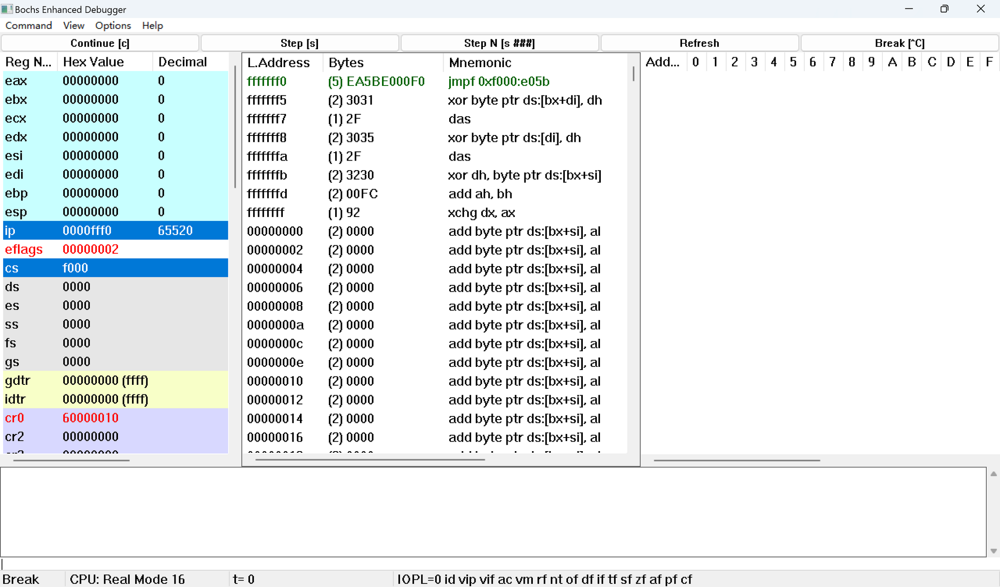

# Where is the first instruction executed in x86 ([Why 0xFFFFFFF0](https://github.com/linuslau/Tips-and-Tricks/blob/main/IA/Notes/001_Reset_Vector_0xFFFFFFF0.md))?

- [Where is the first instruction executed in x86 (Why 0xFFFFFFF0)?](#where-is-the-first-instruction-executed-in-x86-why-0xfffffff0)
  - [First Instruction Executed](#first-instruction-executed)
  - [Register Values After Powerup, Reset, INIT](#register-values-after-powerup-reset-init)
  - [Processor State After Reset](#processor-state-after-reset)
  - [Reset Vector](#reset-vector)
  - [Reset Vector Decoding](#reset-vector-decoding)
  - [Reset Vector List](#reset-vector-list)
  - [Bochs Debugger Breakpoint at 0xFFFFFFF0](#bochs-debugger-breakpoint-at-0xfffffff0)

## [First Instruction Executed](https://www.intel.com/content/www/us/en/developer/articles/technical/intel-sdm.html#inpage-nav-1)

## [Register Values After Powerup, Reset, INIT](https://www.intel.com/content/www/us/en/developer/articles/technical/intel-sdm.html#inpage-nav-1)

## [Processor State After Reset](https://www.intel.com/content/www/us/en/developer/articles/technical/intel-sdm.html#inpage-nav-1)

## [Reset Vector](https://opensecuritytraining.info/IntroBIOS_files/Day1_XX_Advanced%20x86%20-%20BIOS%20and%20SMM%20Internals%20-%20Reset%20Vector.pdf)

## [Reset Vector Decoding](https://opensecuritytraining.info/IntroBIOS_files/Day1_XX_Advanced%20x86%20-%20BIOS%20and%20SMM%20Internals%20-%20Reset%20Vector.pdf)

## [Reset Vector List](https://en.wikipedia.org/wiki/Reset_vector#x86_family_(Intel))

## Bochs Debugger Breakpoint at 0xFFFFFFF0

