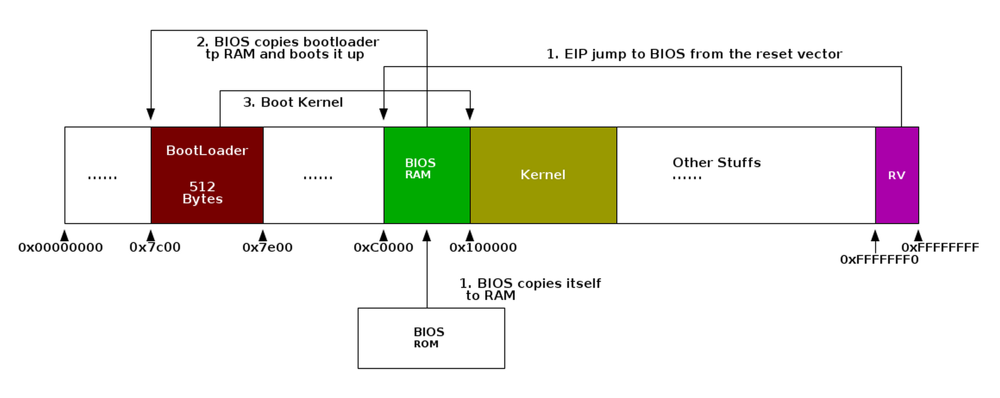

# What's the differnece between [0x7C00](https://github.com/linuslau/kOS-Notes/blob/main/Q&A/001_0x7C00/README.md) and [0xFFFFFFF0](https://github.com/linuslau/kOS-Notes/blob/main/Q&A/003_0xFFFFFFF0/README.md)?

- [What's the differnece between 0x7C00 and 0xFFFFFFF0?](#whats-the-differnece-between-0x7c00-and-0xfffffff0)
  - [E.g. 1. Bootup flow from X86 -\> BIOS -\> OS](#eg-1-bootup-flow-from-x86---bios---os)
  - [E.g. 2. Bootup flow from X86 -\> BIOS -\> OS](#eg-2-bootup-flow-from-x86---bios---os)
  - [Bootup Process](#bootup-process)
    - [Boot process: general](#boot-process-general)
    - [PC architecture](#pc-architecture)

## E.g. 1. Bootup flow from X86 -> BIOS -> OS

## E.g. 2. Bootup flow from X86 -> BIOS -> OS

## [Bootup Process](https://www.cs.yale.edu/homes/aspnes/pinewiki/BootProcess.html)

### Boot process: general

To boot an OS we start with the bare hardware and whatever it provides, and load in increasingly large pieces of the OS until we have our system fully up and running. Typically this may involve several stages:

* Load up or have pre-stored some initial bootstrap routine.
* Bootstrap routine finds and initializes storage devices.
* Bootstrap routine reads boot loader from some boot device (e.g. a hard drive, CD-ROM, or USB key; or in the bad old days: punch cards, paper tape, cassette tapes).
* Boot loader reads kernel from boot device.
* Kernel initializes rest of hardware.
* Kernel loads user-space startup code.
* Startup code brings up user system.

### PC architecture

On an x86 PC, the initial bootstrap is handled by the BIOS, which lives in ROM wired onto the motherboard. The BIOS expects to run in real mode (simulating a vintage 1981 8088-based PC), so that's what the system comes up in. The details of the process are as follows:

* BIOS setup.
  1. On reset, the CPU switches to real mode and jumps to FFFF0. (Really FFFFFFF0, but address gets truncated.) This is the BIOS entry point.
  2. BIOS executes Power On Self Test (POST).
  3. BIOS calls initialization routines provided in ROM by video card (at 0xC0000) and disk controller (0xC8000).
  4. Memory test.
  5. Look for I/O devices and assign them interrupt vectors.
  6. Look for bootable drive.
     * Boot sector at (0,0,1) tagged with 55 AA marker.
  7. Load boot sector to address 0000:7c00.
  8. Jump to boot sector.
* Boot sector.
  1. Initialize stack.
     * SS gets 9000
     * SP gets FFFE (for 16-bit mode)
  2. Load kernel to some standard location, e.g. 0000:1000
  3. Jump to kernel.

The rest of the setup is up to the kernel, and is likely to include switching to protected mode, setting up memory management and interrupt handling, further device initialization, initializing the filesystem, loading user-space programs, etc.