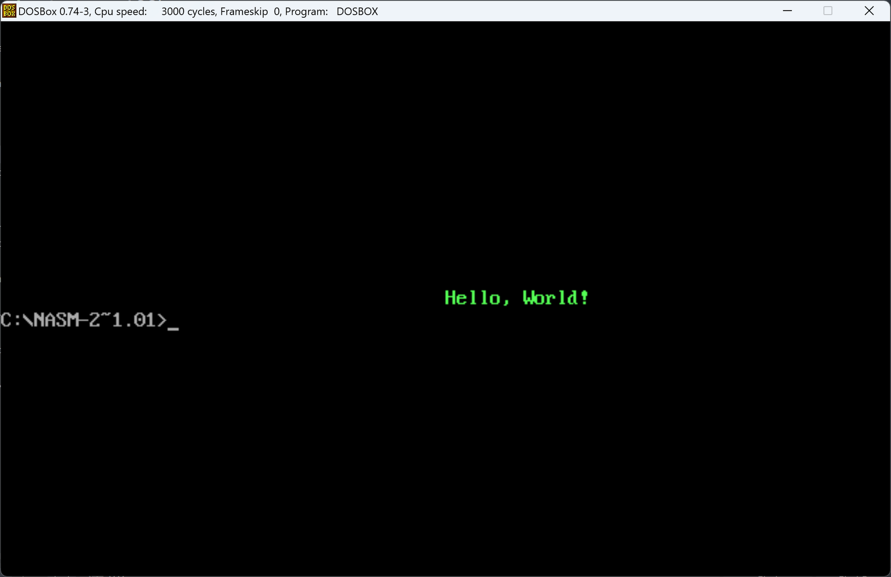
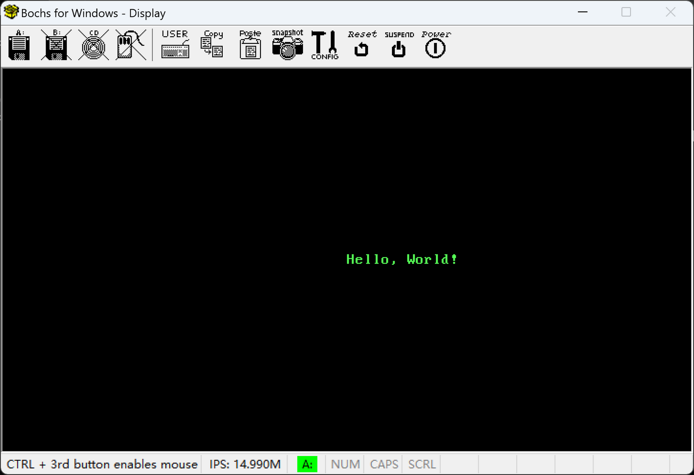
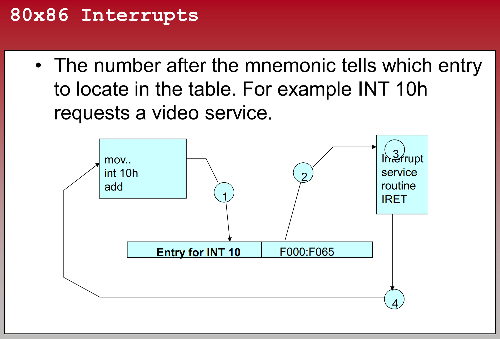
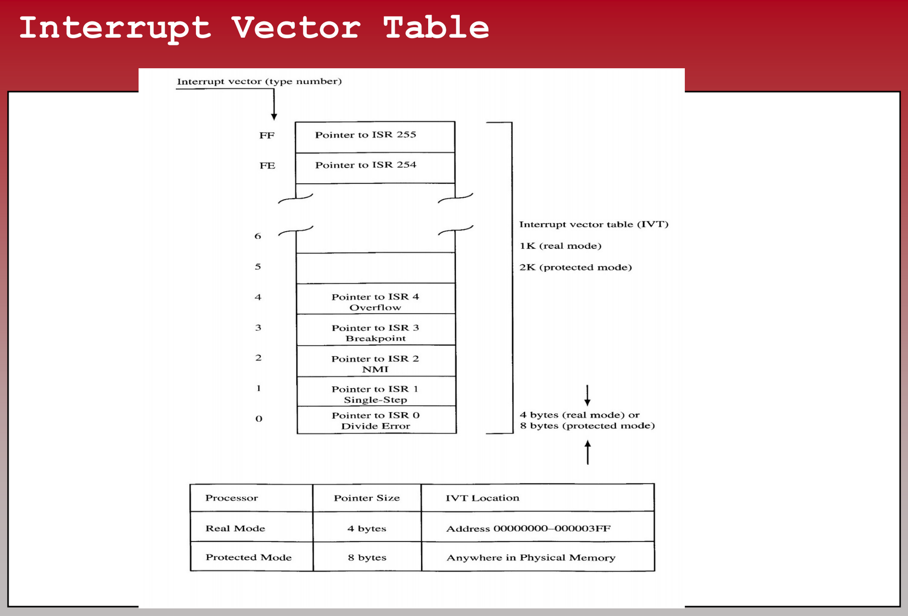
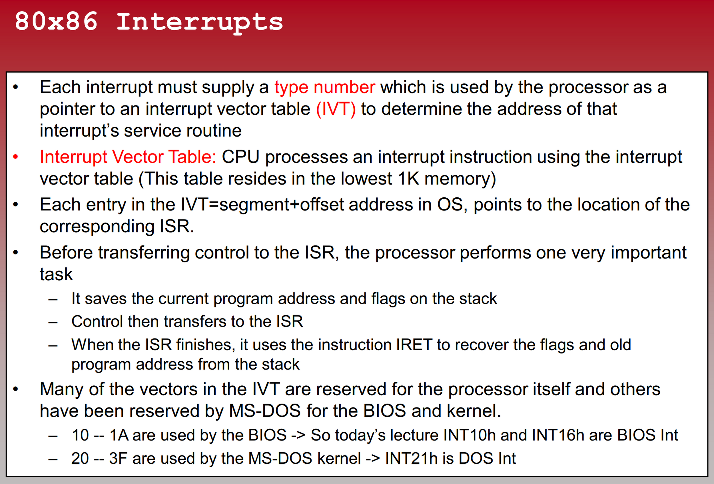
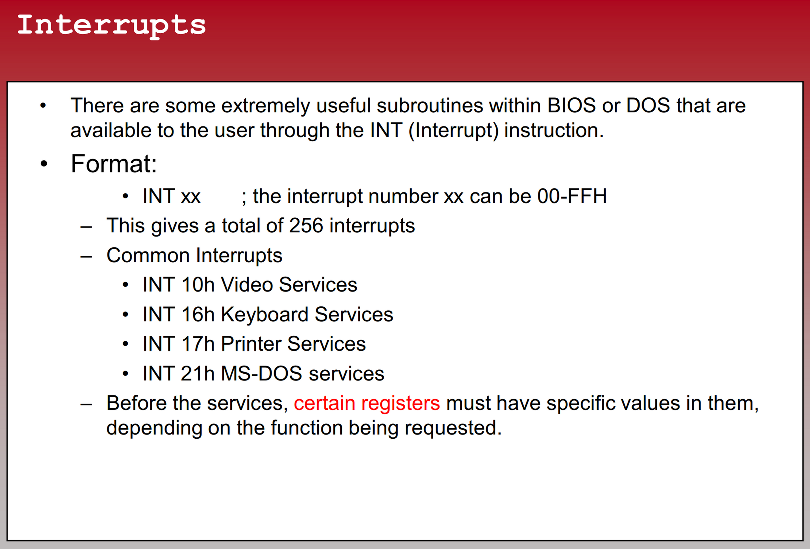

# How to print to screen with BIOS INT 10H (Real Mode)?

- [How to print to screen with BIOS INT 10H (Real Mode)?](#how-to-print-to-screen-with-bios-int-10h-real-mode)
  - [In MSDOS as COM/EXE](#in-msdos-as-comexe)
    - [Code reference](#code-reference)
  - [In MBR as Bootloader](#in-mbr-as-bootloader)
    - [Code reference](#code-reference-1)
  - [Who handles INT 10H?](#who-handles-int-10h)
  - [What is INT 10H in BIOS？](#what-is-int-10h-in-bios)
  - [BIOS INT 10H Sub-functions](#bios-int-10h-sub-functions)

## In MSDOS as COM/EXE



### Code reference

```
org 100h

section .data
    Hello db 'Hello, World!', 0 ; String data with null terminator
    HelloLength equ $ - Hello   ; Calculate the string length

section .text
    global _start

_start:
    ; Set display mode
    mov ah, 00h      ; Function 00h - Set display mode
    mov al, 03h      ; Display mode 03h - Text mode, 80x25 characters
    int 10h

    ; Calculate the column position for the string in the center of the screen
    mov ah, 13h      ; Function 13h - Display string
    mov al, 01h      ; Subfunction 01h - Write string
    mov bh, 00h      ; Page number

    ; Set bl register to green color (font color = green)
    mov bl, 0Ah      ; Green color (low 4 bits)

    lea bp, [Hello]  ; String address

    ; Calculate the column position for the string in the center of the screen
    mov dx, 40       ; Horizontal center column
    mov dh, 12       ; Vertical center row

    mov cx, HelloLength ; String length
    int 10h

    ; Exit the DOS program
    mov ah, 4Ch      ; Function 4Ch - Exit program
    int 21h
```

## In MBR as Bootloader



### Code reference

```
org 7C00h

section .data
    Hello db 'Hello, World!', 0 ; String data with null terminator
    HelloLength equ $ - Hello   ; Calculate the string length

section .text
    global _start

_start:
    ; Set display mode
    mov ah, 00h      ; Function 00h - Set display mode
    mov al, 03h      ; Display mode 03h - Text mode, 80x25 characters
    int 10h

    ; Calculate the column position for the string in the center of the screen
    mov ah, 13h      ; Function 13h - Display string
    mov al, 01h      ; Subfunction 01h - Write string
    mov bh, 00h      ; Page number

    ; Set bl register to green color (font color = green)
    mov bl, 0Ah      ; Green color (low 4 bits)

    lea bp, [Hello]  ; String address

    ; Calculate the column position for the string in the center of the screen
    mov dx, 40       ; Horizontal center column
    mov dh, 12       ; Vertical center row

    mov cx, HelloLength ; String length
    int 10h

    jmp $
```

## [Who handles INT 10H?](https://un.uobasrah.edu.iq/lectures/8108.pdf)






## What is [INT 10H](https://en.wikipedia.org/wiki/INT_10H) in [BIOS](https://wiki.osdev.org/BIOS#BIOS_functionshttps://wiki.osdev.org/BIOS#BIOS_functions)？

**INT 10h**, **INT 10H** or **INT 16** is shorthand for [BIOS interrupt call](https://en.wikipedia.org/wiki/BIOS_interrupt_call "BIOS interrupt call") 10[hex](https://en.wikipedia.org/wiki/Hexadecimal "Hexadecimal"), the 17th [interrupt vector](https://en.wikipedia.org/wiki/Interrupt_vector "Interrupt vector") in an [x86](https://en.wikipedia.org/wiki/X86 "X86")-based computer system. The [BIOS](https://en.wikipedia.org/wiki/BIOS "BIOS") typically sets up a [real mode](https://en.wikipedia.org/wiki/Real_mode "Real mode") [interrupt handler](https://en.wikipedia.org/wiki/Interrupt_handler "Interrupt handler") at this vector that provides video services. Such services include setting the video mode, character and string output, and graphics primitives (reading and writing [pixels](https://en.wikipedia.org/wiki/Pixel "Pixel") in graphics mode).

## [BIOS INT 10H Sub-functions](https://stanislavs.org/helppc/int_10.html)

**For more information, see the following topics:**

[INT 10,0](https://stanislavs.org/helppc/int_10-0.html) - Set video mode

[INT 10,1](https://stanislavs.org/helppc/int_10-1.html) - Set cursor type

[INT 10,2](https://stanislavs.org/helppc/int_10-2.html) - Set cursor position

[INT 10,3](https://stanislavs.org/helppc/int_10-3.html) - Read cursor position

[INT 10,4](https://stanislavs.org/helppc/int_10-4.html) - Read light pen

[INT 10,5](https://stanislavs.org/helppc/int_10-5.html) - Select active display page

[INT 10,6](https://stanislavs.org/helppc/int_10-6.html) - Scroll active page up

[INT 10,7](https://stanislavs.org/helppc/int_10-7.html) - Scroll active page down

[INT 10,8](https://stanislavs.org/helppc/int_10-8.html) - Read character and attribute at cursor

[INT 10,9](https://stanislavs.org/helppc/int_10-9.html) - Write character and attribute at cursor

[INT 10,A](https://stanislavs.org/helppc/int_10-a.html) - Write character at current cursor

[INT 10,B](https://stanislavs.org/helppc/int_10-b.html) - Set color palette

[INT 10,C](https://stanislavs.org/helppc/int_10-c.html) - Write graphics pixel at coordinate

[INT 10,E](https://stanislavs.org/helppc/int_10-e.html) - Write text in teletype mode

[INT 10,F](https://stanislavs.org/helppc/int_10-f.html) - Get current video state

[INT 10,10](https://stanislavs.org/helppc/int_10-10.html) - Set/get palette registers (EGA/VGA)

[INT 10,11](https://stanislavs.org/helppc/int_10-11.html) - Character generator routine (EGA/VGA)

[INT 10,12](https://stanislavs.org/helppc/int_10-12.html) - Video subsystem configuration (EGA/VGA)

[INT 10,13](https://stanislavs.org/helppc/int_10-13.html) - Write string (BIOS after 1/10/86)

[INT 10,14](https://stanislavs.org/helppc/int_10-14.html) - Load LCD char font (convertible)

[INT 10,15](https://stanislavs.org/helppc/int_10-15.html) - Return physical display parms (convertible)

[INT 10,1A](https://stanislavs.org/helppc/int_10-1a.html) - Video Display Combination (VGA)

[INT 10,1B](https://stanislavs.org/helppc/int_10-1b.html) - Video BIOS Functionality/State Information (MCGA/VGA)

[INT 10,1C](https://stanislavs.org/helppc/int_10-1c.html) - Save/Restore Video State  (VGA only)

[INT 10,FE](https://stanislavs.org/helppc/int_10-fe.html) - Get DESQView/TopView Virtual Screen Regen Buffer

[INT 10,FF](https://stanislavs.org/helppc/int_10-ff.html) - Update DESQView/TopView Virtual Screen Regen Buffer

Warning: Some BIOS implementations have a bug that causes register
BP to be destroyed.   It is advisable to save BP before a call to
Video BIOS routines on these systems.

- registers CS, DS, ES, SS, BX, CX, DX are preserved unless explicitly changed

- see  [INT 1F](https://stanislavs.org/helppc/int_1f.html)  [INT 1D](https://stanislavs.org/helppc/int_1d.html)  [INT 29](https://stanislavs.org/helppc/int_29.html)  [INT 21,2](https://stanislavs.org/helppc/int_21-2.html)  [INT 21,6](https://stanislavs.org/helppc/int_21-6.html)  [INT 21,9](https://stanislavs.org/helppc/int_21-9.html)
