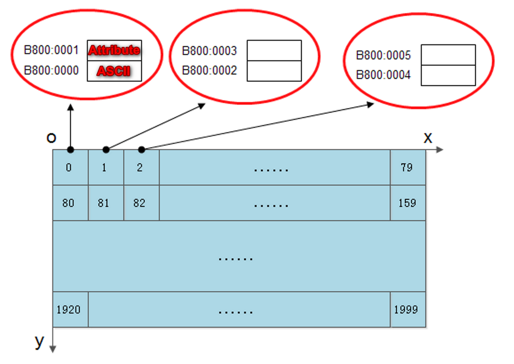
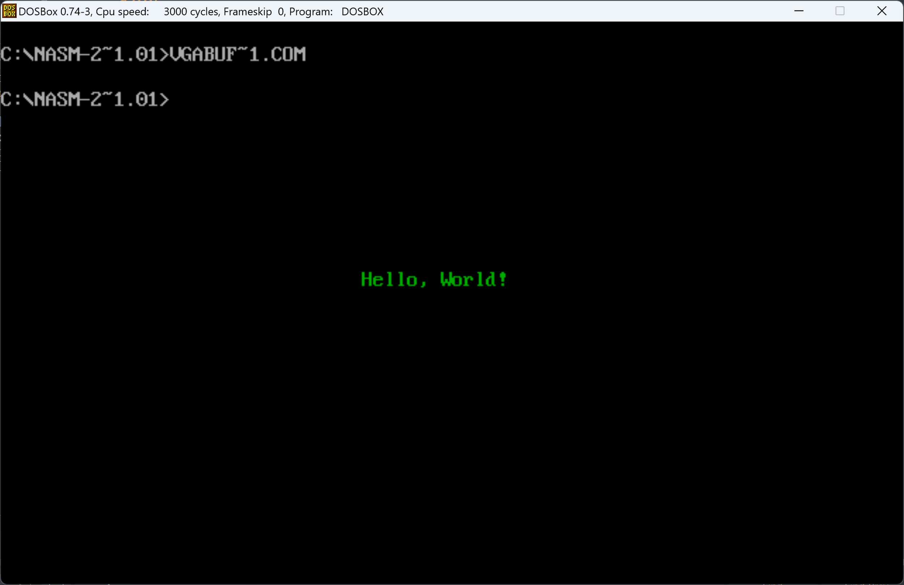
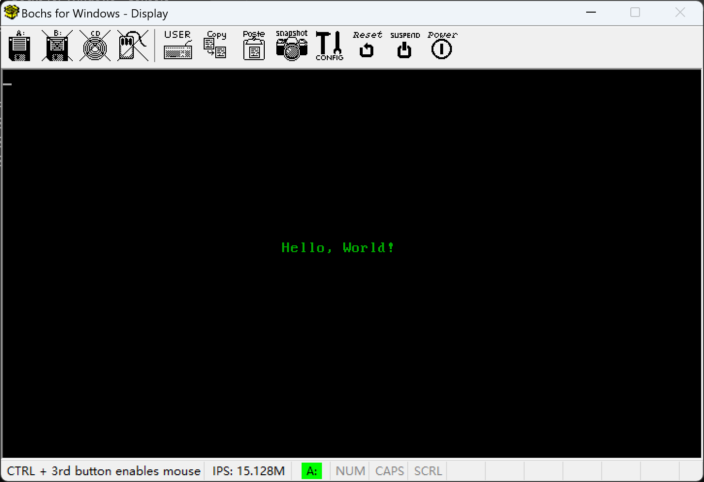
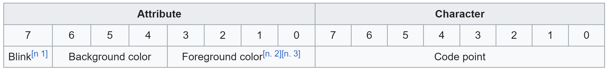
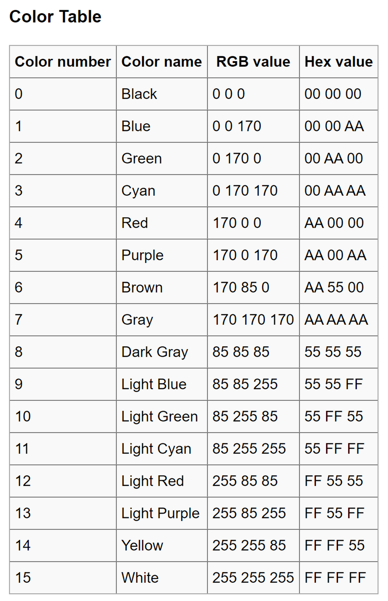
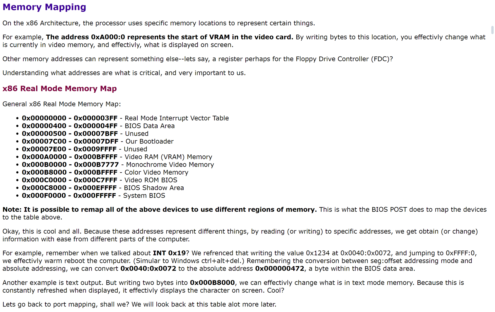
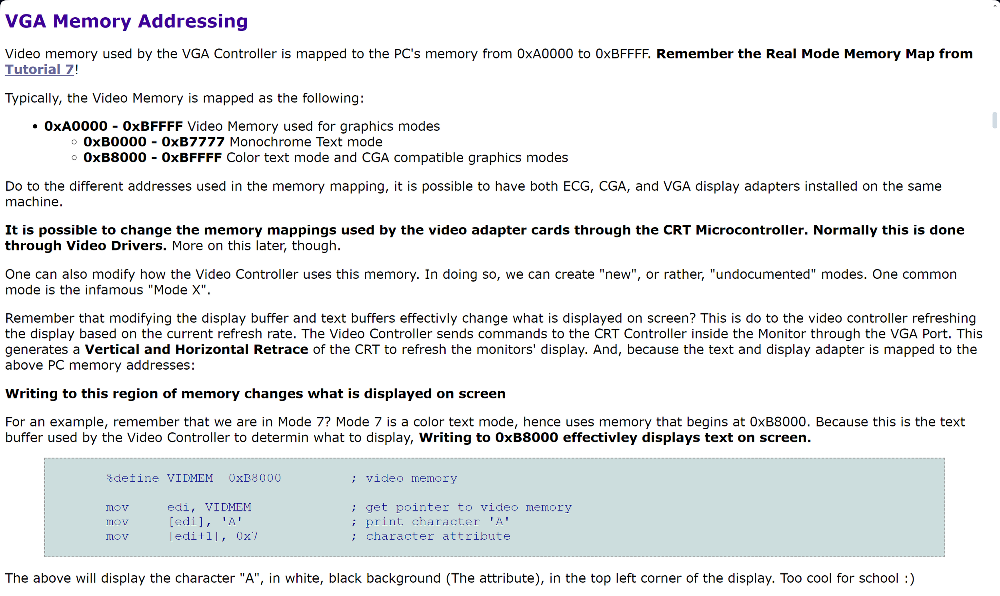
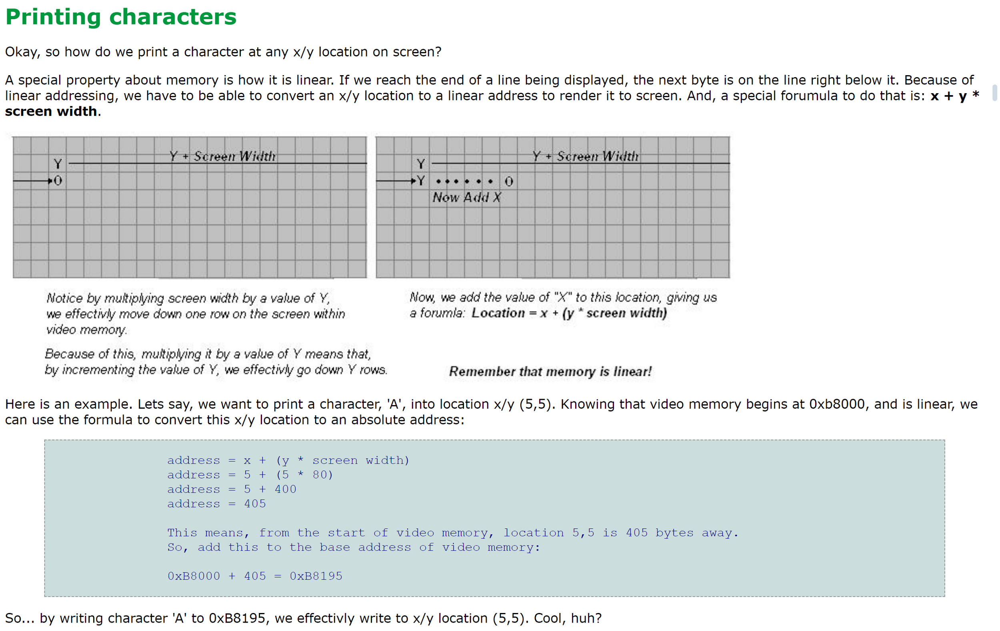

# How to print to screen with VGA Address (0xB8000 Real Mode & Protected Mode)?

- [How to print to screen with VGA Address (0xB8000 Real Mode \& Protected Mode)?](#how-to-print-to-screen-with-vga-address-0xb8000-real-mode--protected-mode)
  - [VGA Memory vs Character](#vga-memory-vs-character)
  - [In MSDOS as COM/EXE](#in-msdos-as-comexe)
    - [Code reference](#code-reference)
  - [In MBR as Bootloader](#in-mbr-as-bootloader)
    - [Code reference](#code-reference-1)
  - [VGA Text Mode](#vga-text-mode)
  - [Text buffer Format](#text-buffer-format)
  - [Color Table](#color-table)
  - [VGA Memory Addressing](#vga-memory-addressing)
  - [How to calculate VGA Memory Address](#how-to-calculate-vga-memory-address)

## VGA Memory vs Character

This mode has 80 colums of characters per row, and 25 lines. And, of course, video memory begins at 0xB8000. But wait! What is the character attribute?

Text Mode actually uses **two** bytes per character, not one. **Remember this!** The first byte represents the actual character, and the second byte is a ...wait for it... attribute byte! Because of this, when writing a character to screen in this Mode, you will need to write **two** bytes, not one.

You have 32 KB of text video memory to use. Since 80x25 mode does not use all 32 KB (80 x 25 x 2 = 4,000 bytes per screen), you have 8 display pages to use.



## In MSDOS as COM/EXE



### Code reference

```
org 100h

section .data
    Hello db 'Hello, World!', 0 ; String data with null terminator
    HelloLength equ $ - Hello   ; Calculate the string length

section .text
    global _start

_start:
    ; Set the address of the display buffer as es
    mov ax, 0xB800
    mov es, ax

    ; Initialize offset
    mov bx, 0
    ; Initialize loop counter
    mov si, 0
    ; Get string length
    mov cx, HelloLength
    ; Loop
_stringloop: 
    mov al, [Hello + bx]        ; Load character from the string
    mov [es:bx + 720h + si], al  ; Write the character to video memory
    mov al, 2            ; Font attribute, the decimal value for green text is 2
    mov [es:bx + 721h + si], al  ; Write the attribute to video memory
    inc bx               ; Move to the next character position
    inc si               ; Increment loop counter
    loop _stringloop              ; Loop

    ; System call to exit the program
    mov ax, 4C00h
    int 21h
```

## In MBR as Bootloader



### Code reference

```
org 7C00h

section .data
    Hello db 'Hello, World!', 0 ; String data with null terminator
    HelloLength equ $ - Hello   ; Calculate the string length

section .text
    global _start

_start:
    ; Set display mode
    mov ah, 00h      ; Function 00h - Set display mode
    mov al, 03h      ; Display mode 03h - Text mode, 80x25 characters
    int 10h

    ; Set the address of the display buffer as es
    mov ax, 0xB800
    mov es, ax

    ; Initialize offset
    mov bx, 0
    ; Initialize loop counter
    mov si, 0
    ; Get string length
    mov cx, HelloLength
    ; Loop
_stringloop: 
    mov al, [Hello + bx]        ; Load character from the string
    mov [es:bx + 720h + si], al  ; Write the character to video memory
    mov al, 2            ; Font attribute, the decimal value for green text is 2
    mov [es:bx + 721h + si], al  ; Write the attribute to video memory
    inc bx               ; Move to the next character position
    inc si               ; Increment loop counter
    loop _stringloop              ; Loop

    jmp $
```

## [VGA Text Mode](https://en.wikipedia.org/wiki/VGA_text_mode)

**VGA text mode** was introduced in 1987 by IBM as part of the [VGA](https://en.wikipedia.org/wiki/Video_Graphics_Array "Video Graphics Array") standard for its [IBM PS/2](https://en.wikipedia.org/wiki/IBM_PS/2 "IBM PS/2") computers.[[1]](https://en.wikipedia.org/wiki/VGA_text_mode#cite_note-pcmag-1) Its use on [IBM PC compatibles](https://en.wikipedia.org/wiki/IBM_PC_compatible "IBM PC compatible") was widespread through the 1990s and persists today for some applications on modern computers.[[2]](https://en.wikipedia.org/wiki/VGA_text_mode#cite_note-solaris-2) The main features of VGA text mode are colored (programmable 16 color [palette](https://en.wikipedia.org/wiki/Palette_(computing) "Palette (computing)")) characters and their background, blinking, various shapes of the [cursor](https://en.wikipedia.org/wiki/Cursor_(computers) "Cursor (computers)") (block/underline/hidden static/blinking),[[3]](https://en.wikipedia.org/wiki/VGA_text_mode#cite_note-3) and loadable fonts (with various glyph sizes).[[4]](https://en.wikipedia.org/wiki/VGA_text_mode#cite_note-pcmag_tutor-4) The [Linux console](https://en.wikipedia.org/wiki/Linux_console "Linux console") traditionally uses hardware VGA text modes,[[5]](https://en.wikipedia.org/wiki/VGA_text_mode#cite_note-fbcon.txt-5) and the [Win32 console](https://en.wikipedia.org/wiki/Win32_console "Win32 console") environment has an ability to switch the screen to text mode for some text window sizes.

## Text buffer Format

Each screen character is represented by two [bytes](https://en.wikipedia.org/wiki/Octet_(computing) "Octet (computing)") aligned as a 16-bit word accessible by the CPU in a single operation. The lower (or character) byte is the actual code point for the current character set, and the higher (or attribute) byte is a [bit field](https://en.wikipedia.org/wiki/Bit_field "Bit field") used to select various video attributes such as color, blinking, character set, and so forth.[[6]](https://en.wikipedia.org/wiki/VGA_text_mode#cite_note-vgatext-6) This byte-pair scheme is among the features that the VGA inherited from the [EGA](https://en.wikipedia.org/wiki/Enhanced_Graphics_Adapter "Enhanced Graphics Adapter"), [CGA](https://en.wikipedia.org/wiki/Color_Graphics_Adapter "Color Graphics Adapter"), and ultimately from the [MDA](https://en.wikipedia.org/wiki/Monochrome_Display_Adapter "Monochrome Display Adapter").



## [Color Table](https://wiki.osdev.org/Printing_To_Screen#Color_Table)



## [VGA Memory Addressing](http://www.brokenthorn.com/Resources/OSDev7.html)




## [How to calculate VGA Memory Address](http://www.brokenthorn.com/Resources/OSDev10.html)


